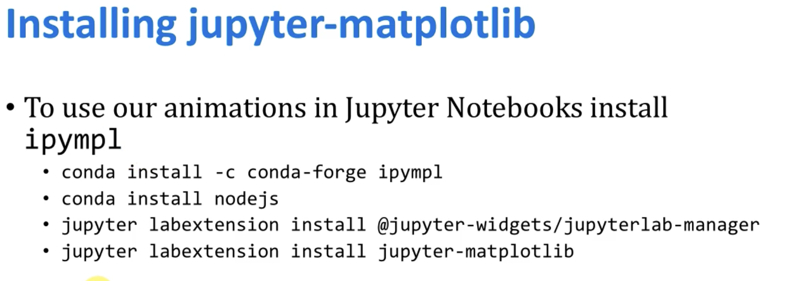
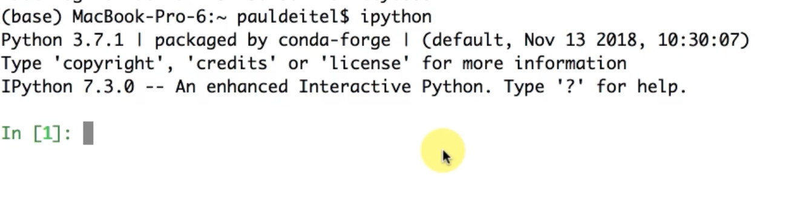
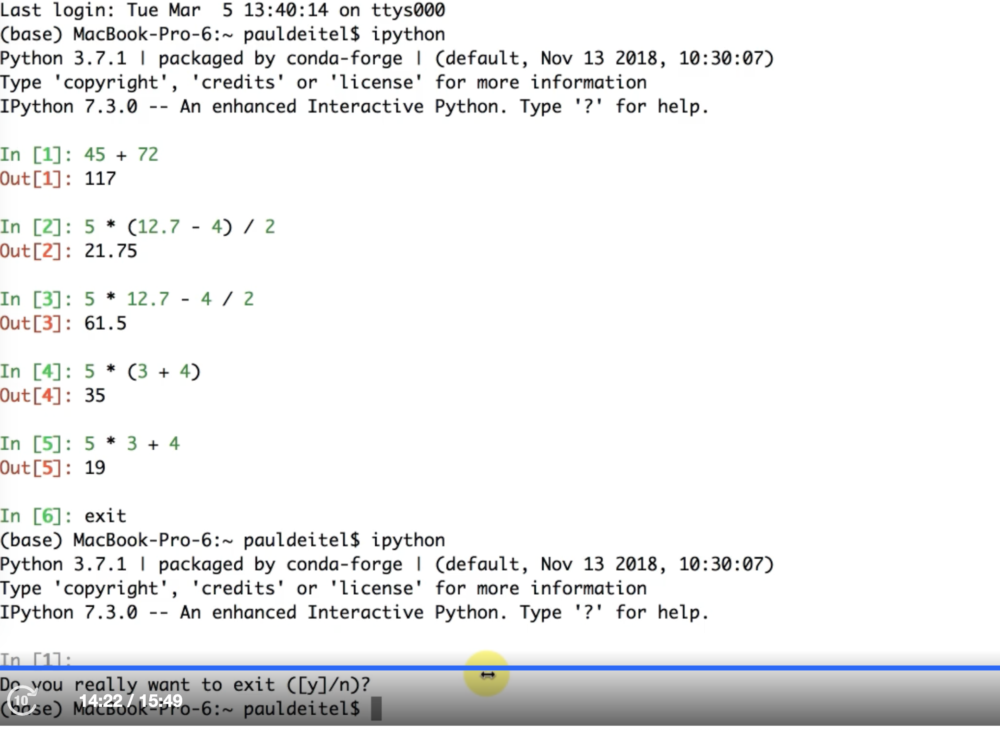

# poc_learn_python

## Docker image used

```
docker pull python:3.12.0b3-bookworm

https://github.com/docker-library/python/blob/3889ee887a25814ba59c379f0260e86d0394c41e/3.12-rc/bookworm/Dockerfile

docker.io/library/python:3.12.0b3-bookworm
```

## Conda update

```
conda update conda
```

## Package managers

`conda` and `pip`

##

## Installing jupyter-matplotlib

Jupyter-Matplotlib is a Python library and a Jupyter Notebook extension that enables the integration and interactive usage of Matplotlib, which is a popular plotting library, within Jupyter Notebook environments.

Matplotlib is a powerful plotting library that allows you to create a wide range of static, animated, and interactive visualizations in Python. Jupyter-Matplotlib provides a seamless integration between Matplotlib and Jupyter Notebook, enhancing the interactivity and usability of plots within the notebook environment.

By using Jupyter-Matplotlib, you can create, update, and manipulate Matplotlib plots directly within Jupyter Notebook cells. It provides features such as automatic figure creation, inline plot rendering, and support for interactive widgets, allowing you to explore and visualize data conveniently.



```sh
conda install -c conda-forge ipympl
conda install nodejs
# or (conda install -c conda-forge nodejs)

# Note that if jupyter lab is not installed, then installed with following commands
# pip install jupyterlab\n
# pip install --upgrade jupyterlab\n
jupyter labextension install @jupyter-widgets/jupyterlab-manager
jupyter labextension install @jupyter-matplotlib

# Alternatively
# jupyter lab extension is depreciated so use this way
conda install -c conda-forge @jupyter-widgets/jupyterlab-manager
#and
pip install ipympl


```

## Difference between conda and pip

Conda and pip are both package managers used in Python for installing and managing packages, but there are some key differences between them:

1. Package Management Philosophy: Conda is a cross-platform package manager that focuses on managing environments with different software dependencies. It can install packages not only from the Python Package Index (PyPI) but also from other channels, including conda-forge, anaconda.org, and others. Conda also manages non-Python dependencies, making it suitable for scientific computing and data science workflows. On the other hand, pip is primarily a package manager for Python packages and installs them from PyPI.
2. Dependency Management: Conda is capable of managing complex dependencies between packages, including both Python and non-Python dependencies. It can create isolated environments with different package versions and handle conflicts between packages. Pip, on the other hand, primarily focuses on Python package installation and relies on requirements.txt files to manage dependencies. It doesn't handle non-Python dependencies or complex dependency conflicts as comprehensively as Conda.
3. Environment Management: Conda provides built-in environment management capabilities. It allows you to create and manage separate environments with different package versions and dependencies. This helps to avoid conflicts between packages and provides better reproducibility. Pip, on the other hand, does not have built-in environment management and typically relies on virtual environments (such as venv or virtualenv) to create isolated Python environments.
4. Platform Support: Conda is a platform-agnostic package manager, meaning it can install packages for different operating systems (Windows, macOS, Linux) and architectures. It can also handle the installation of non-Python dependencies specific to each platform. Pip, on the other hand, is primarily designed for Python packages and relies on platform-specific tools for installing system-level dependencies.

In summary, Conda is more focused on managing environments, handling complex dependencies, and supporting non-Python packages, making it suitable for scientific computing and data science workflows. Pip is primarily focused on Python packages and is commonly used for installing packages from PyPI. The choice between Conda and pip depends on the specific requirements of your project and the complexity of its dependencies.

## [Using IPython Interactive Mode as a Calculator](https://learning.oreilly.com/videos/python-fundamentals/9780135917411/9780135917411-PFLL_Lesson01_01/)

```sh
ipython
```




ipython for math evals




## [Executing a Python Program Using the IPython Interpreter](https://learning.oreilly.com/videos/python-fundamentals/9780135917411/9780135917411-PFLL_Lesson01_02/)


..
